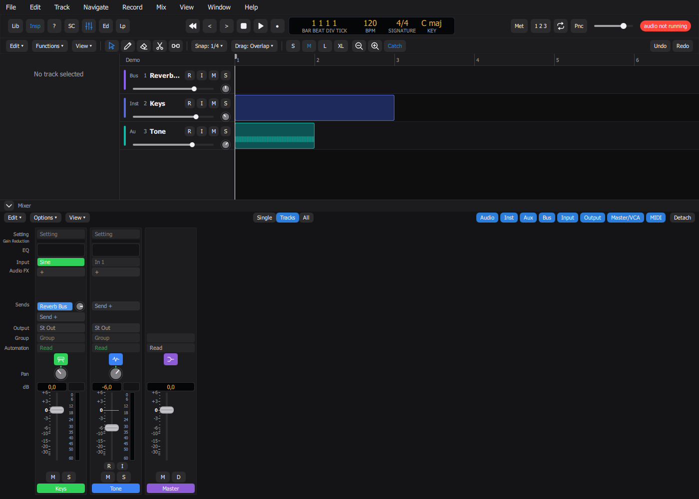
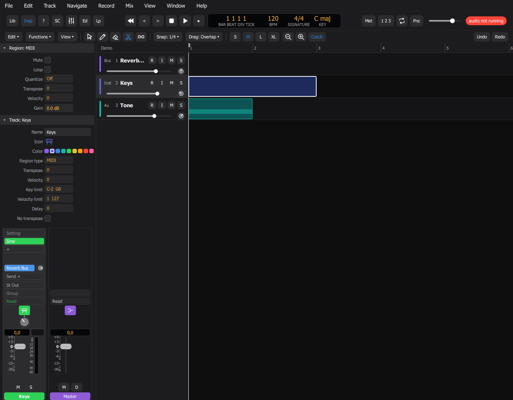
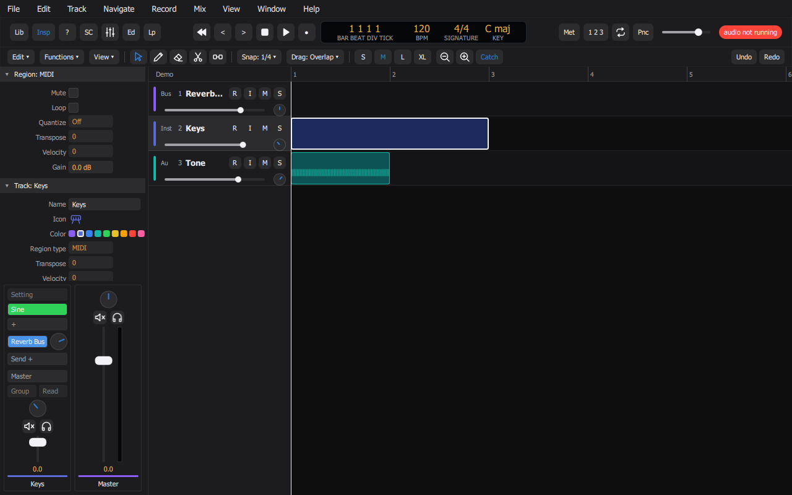
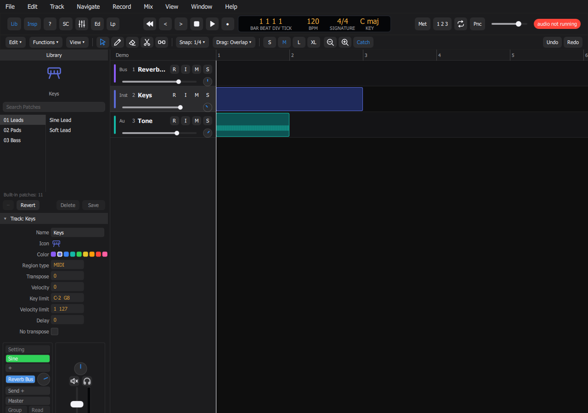
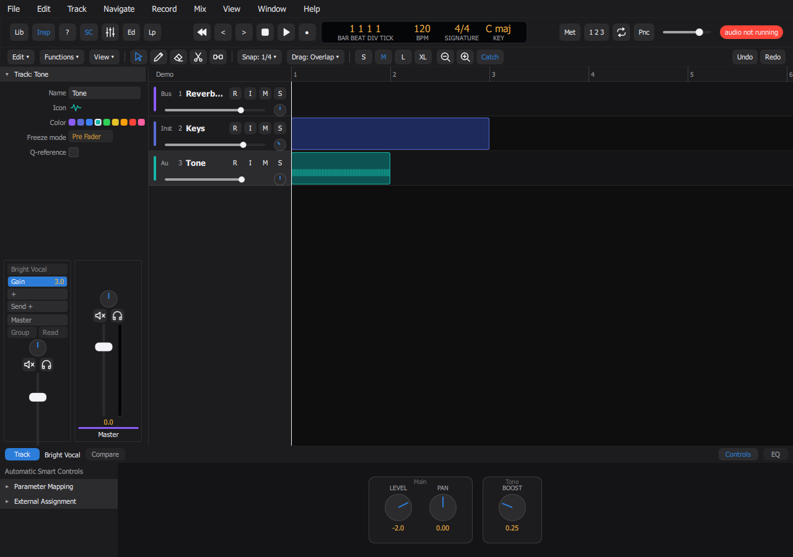
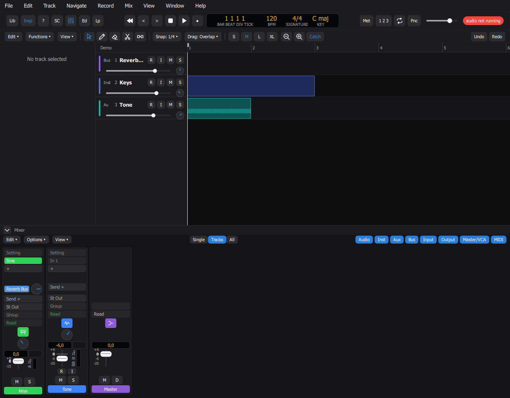
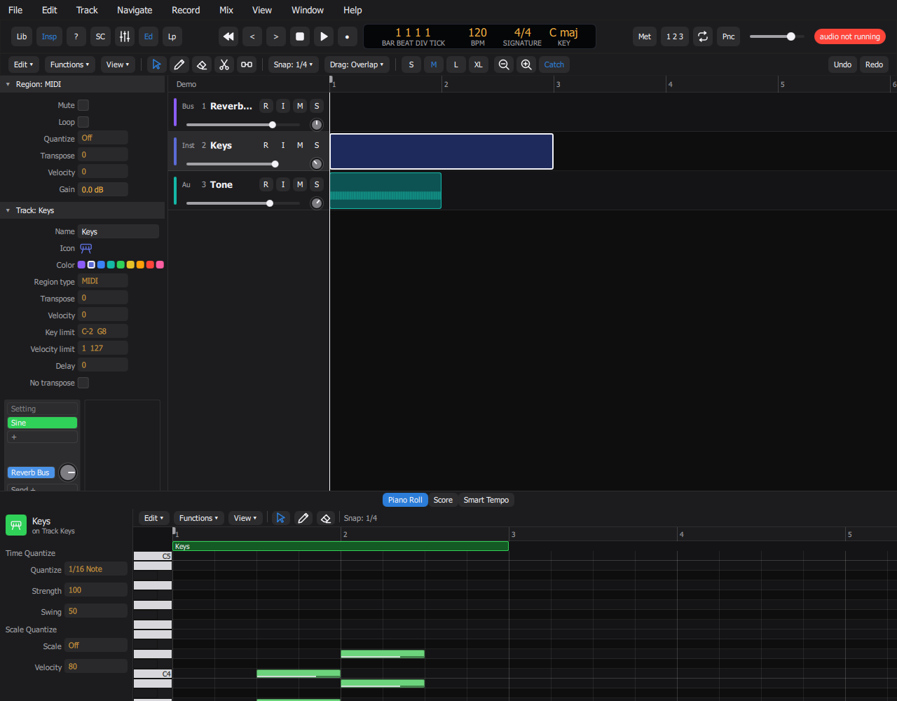
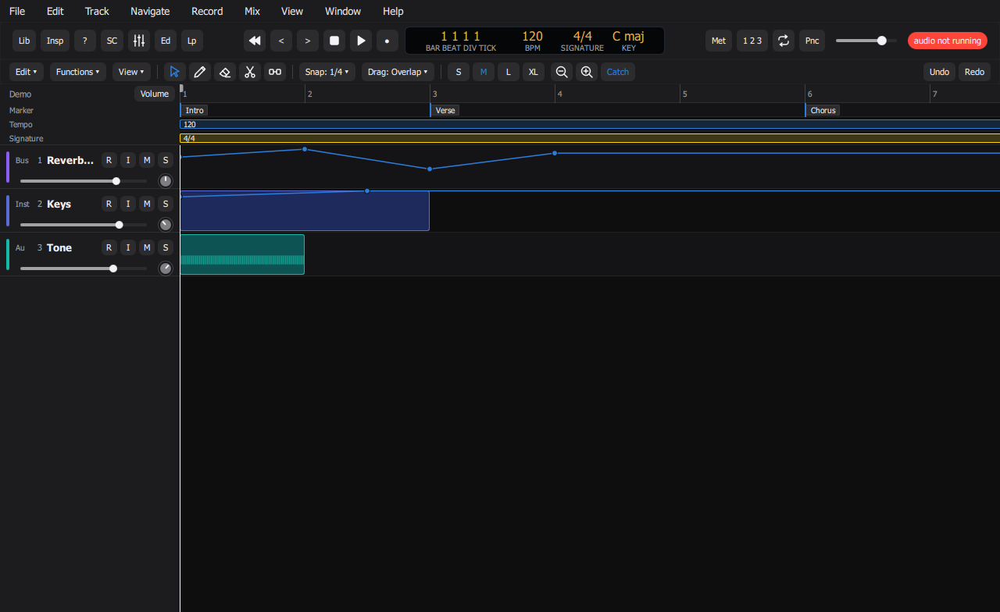
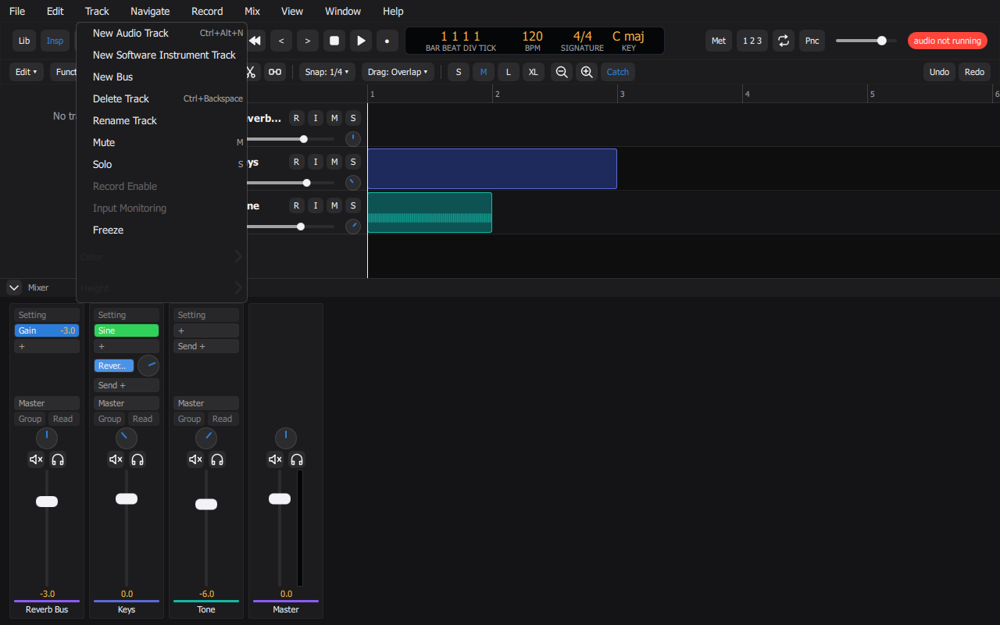

# JAD Daw (Just Another Daw)

Open source (AGPLv3) digital audio workstation, work in progress. This repository currently contains the
**Core** (project model, undoable JSON commands, real-time audio engine, offline renderer, a CLI) and the
**UI shell** (Qt Quick: transport, tracks, timeline, mixer).

## Build (Windows, Visual Studio 2022, CMake)

    cmake -S . -B build -G "Visual Studio 17 2022" -A x64
    cmake --build build --config Debug
    ctest --test-dir build -C Debug --output-on-failure

Use `-DLPC_BUILD_CLI=OFF` to skip the CLI, or `-DLPC_WITH_JUCE=OFF` to build the CLI without audio output
(JUCE is downloaded only when `LPC_WITH_JUCE=ON`).

## CLI

    lpc-cli demo demo.lpc                  # write a small demo project
    lpc-cli info demo.lpc
    lpc-cli render demo.lpc out.wav        # deterministic offline bounce
    lpc-cli play demo.lpc                  # needs a 48 kHz output device

## UI

The UI needs Qt 6.8 (LGPLv3, linked dynamically) and is off by default.

    tools/setup-qt.sh                       # or tools/setup-qt.ps1; installs Qt into ./.qt (aqtinstall)
    cmake -S . -B build-ui -A x64 -DLPC_BUILD_UI=ON "-DCMAKE_PREFIX_PATH=$(pwd)/.qt/6.8.3/msvc2022_64"
    cmake --build build-ui --config Debug
    build-ui/ui/Debug/jad-daw --project demo.lpc

On Windows the Qt DLLs are copied next to the executables after each build, so they start by double click and
`ctest --test-dir build-ui -C Debug` needs nothing on `PATH`.

### Window and shortcuts

- Menus (File, Edit, Track, Navigate, Record, Mix, View, Window, Help), control bar with LCD, local toolbar, track
  headers, timeline and mixer. Every action comes from one table, `ui/actions/actions.json`: label, menu, default
  shortcut (Logic Pro's), and whether it is **ready** or a **stub**.
- A stub is present and can be switched on, but nothing is behind it yet (recording, metronome, count-in, punch,
  Score, Step Sequencer, Session Players, plug-in automation...). Switching a stub on shows a "not implemented yet" notice; switching it off
  shows nothing. Everything else works through the Core's JSON commands, with undo/redo.
- Real today: open/create/save projects (a `.lpc` folder), play, locate, cycle, tempo and time signature (double click
  the LCD), master volume, tracks (new, delete, rename, colour, heights, select with click / Shift / Ctrl), mute, solo,
  fader and pan, regions (select, rectangle select, move, resize from the edges, split, join, delete, draw an empty
  MIDI region with the pencil, import `.wav` by dropping it on a track), snap, zoom, catch playhead.

- **Inspector** (`I`, or the Inspector button): the Region and Track sections of the selected region and track, and two
  channel strips (the track and its output). Real: region gain, track name and colour, and everything on the strips
  (insert gain, sends, output, pan, fader, mute, solo). Quantize, Loop, Transpose, Key and Velocity limits, Delay and the
  like have no engine yet: they are visual only and say so when switched on.

- **Library** (`Y`): the patches of the selected track's kind, by category, with search; click a patch or step with the
  Up and Down keys to apply it (strip values, inserts and instrument in one undo step); Revert applies the track's patch
  again. The catalogue is `core/data/patches.json`; the engine has one effect and one synth for now, so the built-in
  patches differ mostly in level, pan and a gain insert. Save, Delete and the Options menu are not implemented.

- **Smart Controls** (`B`): the screen controls of the selected track's patch, grouped in panels; drag a knob (Shift for
  fine, double click resets). A knob can move several parameters at once (the patch decides), and one release is one undo
  step. Parameter Mapping, External Assignment, Compare and the EQ tab are not implemented.

- **Plug-ins (VST3 effects)**: click the `+` slot of an insert area: Gain or any scanned VST3 plug-in, grouped by vendor.
  Double click a plug-in slot to open its own window. The scan runs in the background at start (in a child process: a plug-in
  that crashes or hangs is listed as failed and skipped) and its result is cached in `plugins.json` in the application config
  folder; Window > Plug-in Manager shows the result and rescans. A plug-in that is not installed shows in red and passes the
  sound through; the project keeps its id and state. Plug-in state is saved with the project, one undo step per editor session
  (committed when the editor closes and before Save). Delay compensation aligns tracks and buses. `lpc-cli render` hosts
  plug-ins too (a plug-in that is not installed is reported and skipped).

- **Mixer** (`X`): one strip per track, built from the same channel-strip component as the Inspector (instrument,
  inserts, sends, output, pan, fader, mute, solo), the master strip last. Double click a strip name to rename the track (Return
  or a click elsewhere confirms, Escape cancels); a click selects it. "New Bus" in a Send or Output menu makes a bus that lives in
  the Mixer only; Track > Show in Tracks Area puts a bus or aux in the Tracks area (and takes it out again).
  Inserts: the power dot on the left of an insert switches it off (it keeps its delay compensation, so nothing shifts in time);
  Alt-click on the name does the same. Drag an insert up or down to reorder the chain, or onto another strip to move it to that
  track (a plug-in keeps its state and its live instance; a Gain insert moves with a vertical drag, a horizontal drag changes its
  gain until the pointer leaves the strip). Shift-click on a send or on the Output slot shows that bus in the right strip of the
  Inspector; right-click on a send sets it pre-fader. A click on the instrument slot, or a double click on a track header, opens
  the Library. The Smart Controls pane has a drag handle on its top edge.
  The Mixer follows Logic's layout: a legend column, rows at fixed heights (Setting, Gain Reduction, EQ, Input, Audio FX, Sends,
  Output, Group, Automation, icon, Pan, dB), a fader with Logic's taper (+6 dB at the top, 0 dB at 74% of the travel) and a dB scale,
  a level meter with its scale, R and I, M (blue) and S (yellow), and a name bar in the colour of the strip type. Click the dB field
  to type a value; Option-click on a fader or a knob resets it, Shift-drag moves the fader finely, Option-click on S solos that
  strip alone (or clears every solo). A lit solo shows an S indicator in the Tracks toolbar and turns the playhead yellow. The
  Mixer header has Edit, Options and View menus, Single | Tracks | All and the strip type filters (most menu entries are not
  implemented yet). In a short window the strips become compact and the legend is hidden.

- **Mixer window and size:** the Mixer can be detached into a window of its own (the Detach button in its bar, Window > Open Mixer,
  Ctrl+2) and docked again (Dock). Docked, drag its top edge to change its height; it is never shorter than the strips with their
  legend, and in its own window it takes all the height it is given, however large (the faders grow). A narrow Mixer drops the type
  filters and then Single | Tracks | All from its bar and scrolls sideways.
- **Live drags:** while a fader, a pan knob or the volume slider of a track header is dragged, every other strip, field and header
  follows and the sound changes at once; the whole drag is one undo step.
- **Editors** (`E`, the Ed button, or a double click on a region): the Piano Roll with the keyboard, the ruler, the region bar and the
  notes of the selected MIDI region. Pointer: click selects (Shift extends), drag moves, drag either end of a note resizes it, Option-click
  draws a note; Pencil draws a note; Eraser deletes; Delete removes the selection. Quantize (strength, swing, Dequantize), Scale Quantize
  (scale, key, Snap to Scale), velocity lane, transpose, nudge, Mute Notes and copy/paste of notes work, and every change is one undo
  step. The other tabs say they are not implemented yet.
- **Tracks area extras:** right-click on an empty part of an instrument track offers Create MIDI Region; the Global Tracks (Track >
  Show Global Tracks, `G`) add Marker, Tempo and Signature lanes under the ruler (double-click adds, drag moves a marker, right-click
  deletes); the cycle area is drawn along the top of the ruler and can be dragged, moved and resized; Mix > Show Automation (`A`)
  draws the volume or pan automation of each track over its row (click adds a point, drag moves it, Option-click or double-click
  deletes it) and the lane drives the fader while it exists. Strips show real per-track meters and a peak field (click resets).
- **Metronome:** the Met button (`K`) clicks on every beat while playing, with an accent on the first beat of a bar; it follows the
  tempo and the time signature. Record > Metronome Settings chooses how a bar is counted (beats `1 2 3 4`, eighths `1 & 2 &`,
  sixteenths `1 e & a`, or grouped `1 la li 2 la li`, with groups such as `3+2+2` for 7/8) and a WAV file of your own for each count
  (a voice saying the numbers, a cowbell...); a count without a file plays the built-in click. No sounds are shipped with the app.
- **Recording (audio):** arm an audio track with its R button, press Record (`R`) and the input of the audio device is captured from the
  playhead until Stop; the take becomes a region in that track (one undo step). The Count-in button (`1 2 3`) plays the count-in
  first; Record > Count-in chooses None, 1 to 6 bars or 1/4, 2/4, 3/4 (beats), as in Logic. Not there yet: MIDI recording, input monitoring, latency compensation, punch in/out, several armed tracks, takes and comping.
- **Importing audio:** drag WAV, MP3, FLAC or AIFF files into the Tracks area (or File > Import Audio File). On an audio track they go there
  back to back; anywhere else each file makes a new audio track named after it. Files at another sample rate are converted to the
  project's (cubic interpolation) and stored as 24-bit WAV in the project folder. MP3 and FLAC are decoded with dr_mp3 and dr_flac
  (`third_party/dr_libs`, public domain / MIT-0).
- **File:** Save As, Save a Copy As, Import Audio File and Bounce (an offline render to a 24-bit WAV; plug-in inserts are skipped).

- Shortcuts: to change some, create `shortcuts.json` in the application config folder (for example
  `%LOCALAPPDATA%/JAD/JAD Daw/` on Windows, `~/.config/JAD/JAD Daw/` on Linux) with only the actions you want to
  change, e.g. `{"transport.playStop": "P"}`. Unknown actions, invalid sequences and sequences already used by another
  action are ignored and logged. Only some default shortcuts are confirmed against Logic Pro; the checklist is in
  `docs/shortcuts-check.md`.
- Screenshots (used above) are taken by the app itself:
  `jad-daw --project demo.lpc --no-audio --screenshot out.png --size 1280x800 [--tool scissors] [--select-track 2] [--select-region 1] [--open-menu 2] [--panels library,inspector,smart,mixer,editors,global,automation] [--apply-patch audio.bright-vocal]`.

Known limits: the macOS bundle has no icon yet, several
buttons use text labels because there are no icons for them yet, and the panels behind Quick Help, Editors and Loops do
not exist yet. The engine has one effect (gain) and one synth (sine), so the built-in patches and Smart Controls are
small; plug-ins are VST3 effects only (no instruments, MIDI, sidechain or automation of plug-in parameters), stereo in and out, Windows only, and a plug-in that crashes while playing takes the app down; changes made inside a plug-in window become one undo step when it closes. A project with a track name that is empty, longer than 64 characters or has
control characters, or with an unknown track colour is rejected on load.

Design: `docs/superpowers/specs/2026-10-07-core-engine-design.md`, UI: `docs/superpowers/specs/2026-10-07-ui-shell-design.md` `docs/superpowers/specs/2026-10-08-ui-a-frame-design.md` and `docs/superpowers/specs/2026-10-08-ui-b-panels-design.md`. Third-party licences: `THIRD_PARTY.md`.
